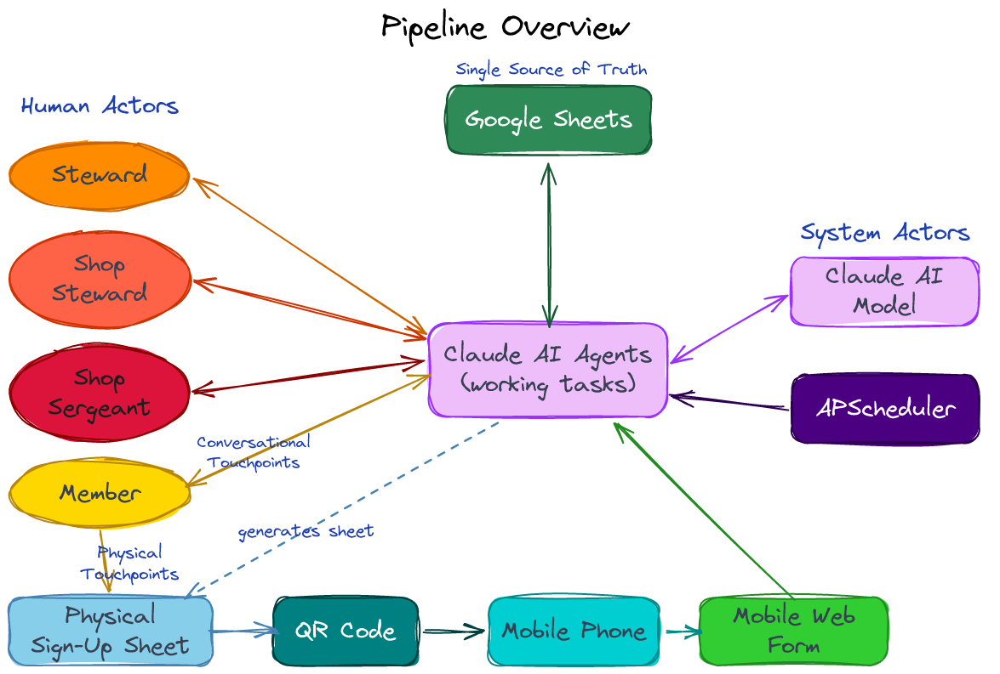
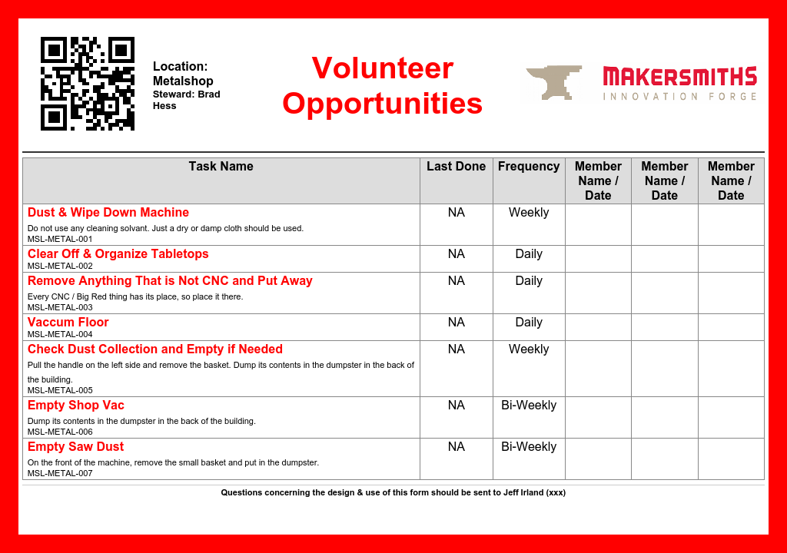
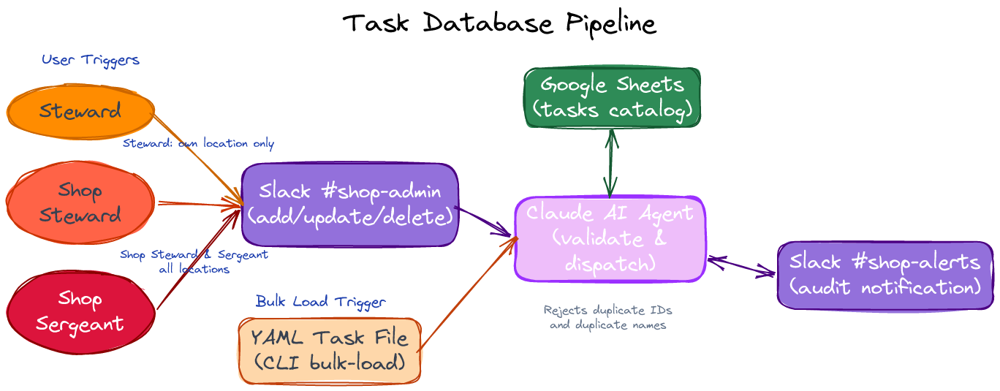
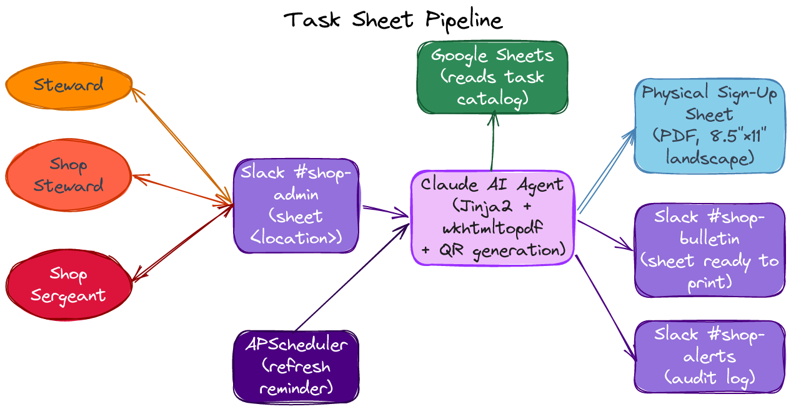
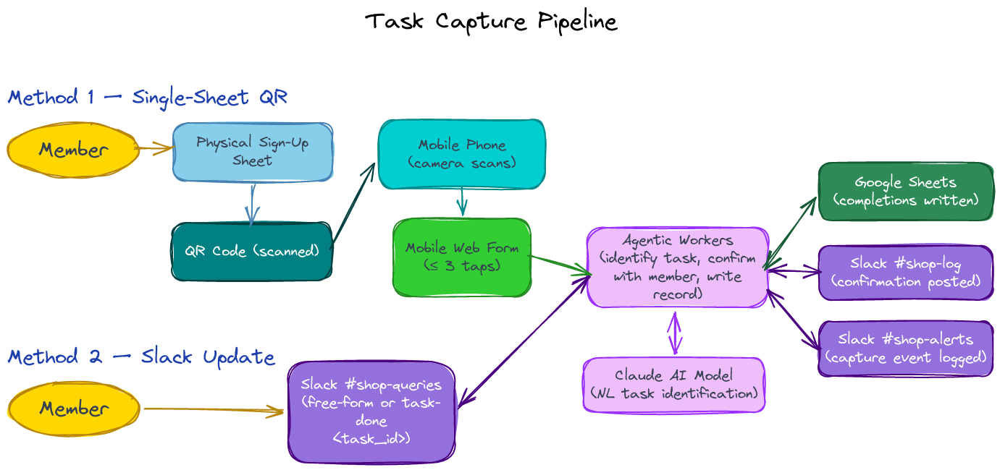
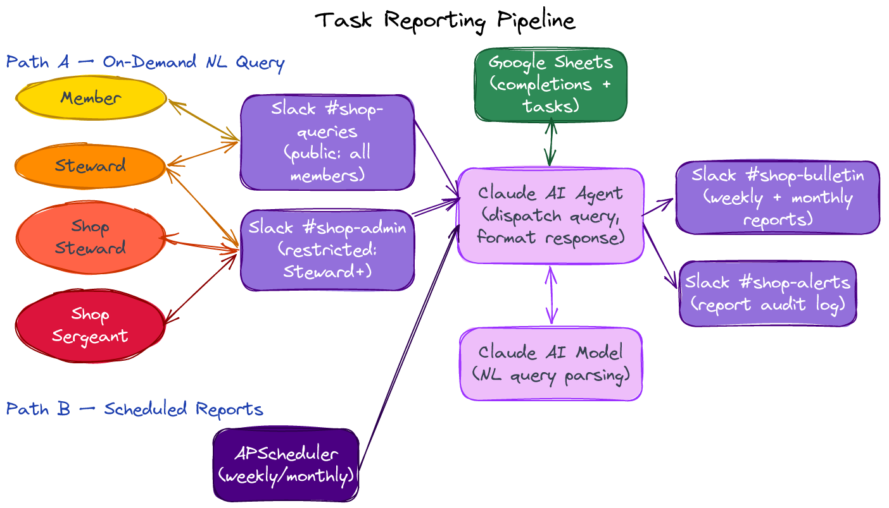

# Shop Sergeant

**Membership Meeting Review**

Jeff Irland  ·  May 6, 2026  ·  Makersmiths Leesburg (MSL)

---

# What is the Problem

* MSL has some truly outgoing Volunteers, especially Stewards,
  the volume of regular tasks needs to be delegated across the shoulders of other Members.
* Constantly reiterating the same needs to volunteers can become a wearisome obligation for Stewards.
* The most immediate tasks get attention, but the routine cleaning, organizing, and maintaining the Shops can suffer.

**Initial Steps:**
1. Need a MSL volunteer to communicate with the Leesburg Stewards and coordinate a comprehensive to-do list for the Shops,
   including regular cleaning tasks and preventative maintenance.
1. With assistance of Stewards, establish a thorough checklist for each Shop, on it’s own clipboard near the Shop entry,
   to log volunteer hours and keep an eye on what’s not getting done.

**Strategic Vision:**
1. Remove as much friction as possible from the current process via simplifying, regularizing, and automating.
1. Engage, motivate, and recognize Members contribution by making the process more visible

---

# Shop Sergeant: Why We Need This

MSL's current work task volunteering process has several weaknesses.
A new automated process, called **Shop Sergeant**, is proposed to **remove much of the friction in the current process**,
**make work task activity more visible**, and gather data to **measure our continuing improvement**.
This new process uses Slack as its primary communication/control medium,
but can also be trigger via a few clicks on a mobile phone web form.

**Current paper-only process has 5 critical gaps:**

| **Gap** | **Problem** | **Impact** |
|---|---|---|
| **Incomplete records** | Members rarely write their name and date after completing a task | No reliable record of who did what — member contribution data simply doesn't exist |
| **No cumulative history** | Sign-up sheets are discarded when replaced | No historical data to support MSL's 501(c)(3) volunteer-labor documentation |
| **No steward monitoring** | Stewards have no way to see overdue or ignored tasks | Problems surface only when equipment breaks or a safety issue arises — never proactively |
| **No scheduling** | Periodic tasks have no mechanism to track whether they were done on time | Maintenance gets forgotten; equipment degrades; safety risks accumulate |
| **No recognition** | Top contributors can't be identified because records don't exist | Highly engaged members receive no recognition; motivation and community goodwill suffer |

---
layout: two-cols-header
---

# Shop Sergeant: Agentic AI Capabilities
Using Claude for two primary capabilities:

::left::

**1. Natural Language Query Processing**
* Members & Stewards ask questions in plain English:
  > "What tasks are still open in the metalshop?" "How many tasks have members done this month?"
* Members ask for information or instructions in plain English:
  > "Give me instructions on how to clean MSL-METAL-005" "When was the bandsaw last cleaned?"
* Claude parses the question, constructs the Google Sheets query, and formats an answer, and response back via Slack.

::right::

**2. Slack Update Task Processing**
* Member posts in `#shop-queries`:
  > "I just finished cleaning the metalshop floor" "Wednesday I spent 1 hour fixing the broken front door lock"
* Claude identifies the most likely task, presents it for member confirmation, then writes to Google Sheets. 
  If no match, offer to ask for approval to make a new task item.

**What Claude agents will NOT be allowed to do:**
* Modify data without member confirmation
* Execute administrative commands from `#shop-queries`
* Access data or perform tasks outside its targeted function

---
layout: center
---

---

# Task Capture Sign-Up Sheet — Example Output

_Metalshop sign-up sheet (v2) — single QR code in header  · 8.5×11" landscape · black-and-white printable_

---
layout: center
---

# Questions & Discussion

* **eMail:** <jeff.irland@verison.net>
* **Slack:** jeff.irland
* **Source:** `github.com/jeffskinnerbox/makersmiths-shop`
  * **Full requirements:** `docs/requirements.md`
  * **Next document:** `docs/specifications.md`

---
layout: center
---

---
layout: center
---

---
layout: center
---

---
layout: center
---

